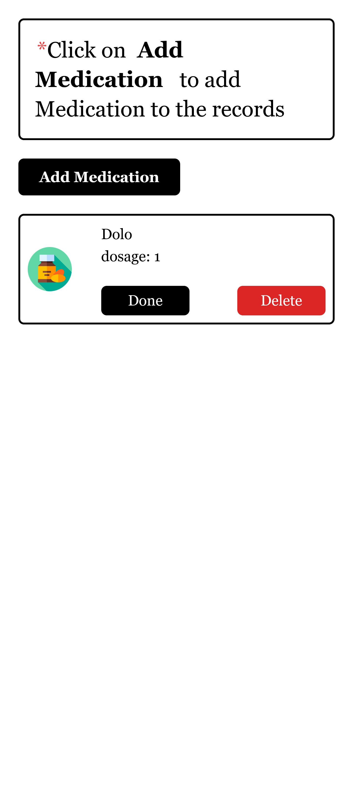
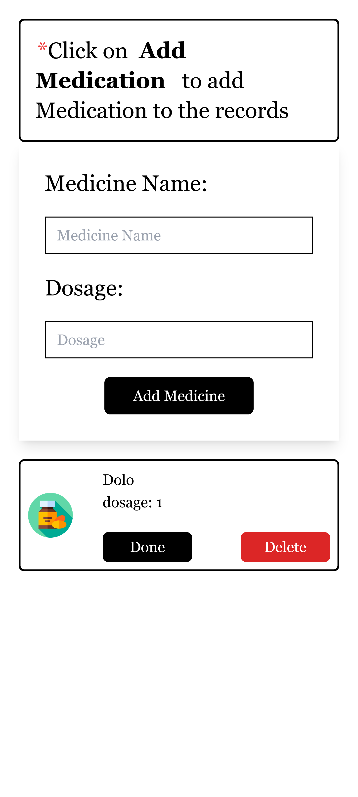
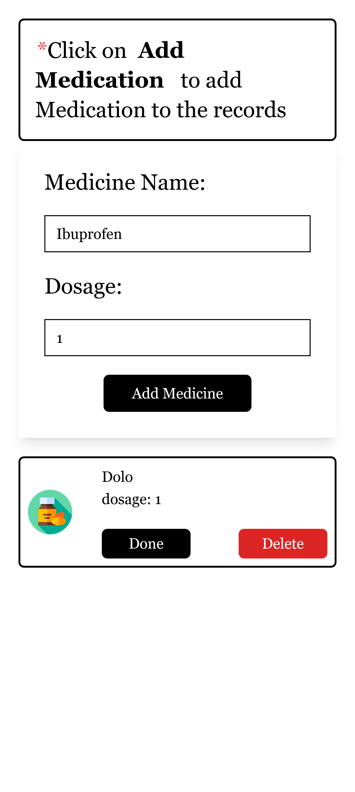
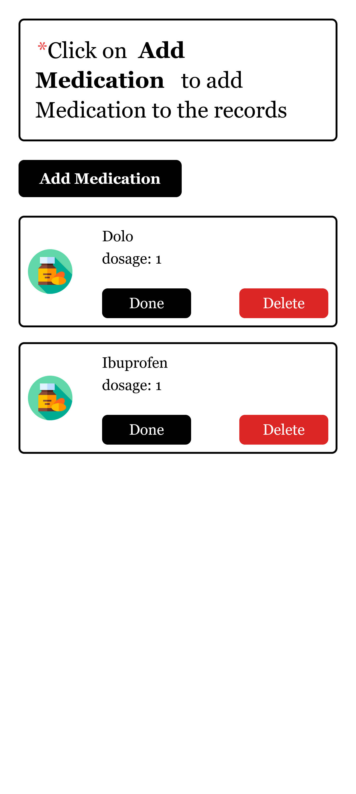

# Medication Tracker

This is a web application that allows users to store information about their medication and track when they need to take it. The app shows you what medications you need to take for the day

## Features

- Add new medication with details such as name, dosage, and frequency
- Mark it as Done when you have the current days' medication
- Delete medication
- View a list of all medications with details
- Responsive design for mobile and desktop devices

## Technologies

- React.js + Vite.js and TailwindCSS for the frontend
- Node.js with Express.js for the backend
- SQLite for data storage
- JWT for user authentication

## Installation

1. Clone this repository to your local machine
2. Install the necessary dependencies by running `npm install` in both the client and server directories
3. "npm run dev" to star the server

